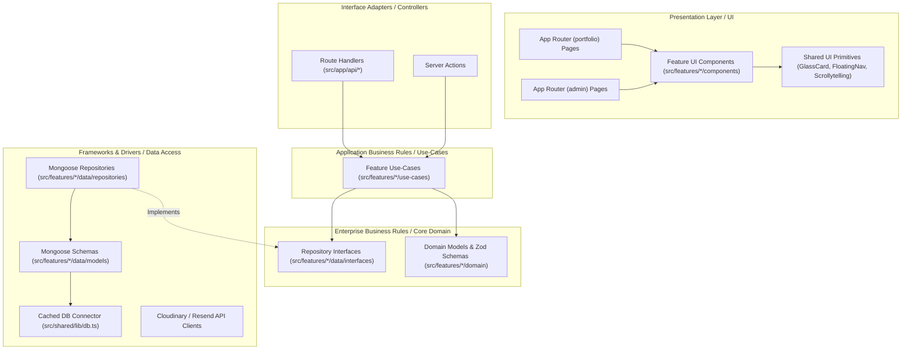

# Implementation Plan: Clean Architecture & Feature-Driven Portfolio + Admin CMS

A modular, enterprise-grade architecture for the Next.js and MongoDB portfolio monorepo, structured with **Clean Architecture principles (Domain, Use-Cases, Data Access, UI)** and organized **Feature-by-Feature** to ensure strict separation of concerns, testability, and maintainability.

---

## Progress Overview

| Phase | Milestone | Status | Completed Issues |
| :--- | :--- | :--- | :--- |
| **Phase 1** | **Foundation & Database Engine** | **COMPLETED** ✅ | `#BACKEND-01`, `#BACKEND-02`, `#BACKEND-03`, `#BACKEND-10`, `#BACKEND-11` |
| **Phase 2** | **Design System & Public Client Experience** | **COMPLETED** ✅ | `#CLIENT-01` to `#CLIENT-12` |
| **Phase 3** | **Secured Admin CMS & Security Suite** | **COMPLETED** ✅ | `#BACKEND-04` to `#09`, `#ADMIN-01` to `#09` |
| **Phase 4** | **Production Readiness & Vercel Deployment** | **COMPLETED** ✅ | Live Atlas DB Connection, Form Modals, Vercel Config |

---

## 1. Clean Architecture & Feature-Wise Directory Design

