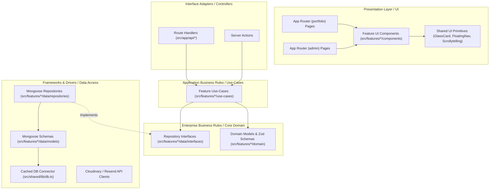

# Modern Portfolio & Admin CMS Monorepo
## Clean Architecture & Feature-Driven AI Development Blueprint (Single Source of Truth)

---

## 1. Project Overview & Vision
This document serves as the **authoritative single source of truth** for all architectural, design, engineering, security, and data conventions used across the **Client Portfolio & Headless Admin CMS**.

The application is engineered as a high-performance, single Next.js monorepo deployed serverlessly on **Vercel's Free Tier** backed by **MongoDB Atlas**, structured using **Clean Architecture principles** and **Feature-driven modules**:
- **Public Client Experience**: Apple-inspired frosted glass depth, 3D Scrollytelling, expandable timeline milestones, filterable case studies, testimonial showcases, and an interactive contact interface.
- **Secured Admin CMS**: Direct control to create, update, reorder, and publish content across every page without redeploying code.

---

## 2. Clean Architecture Layer Hierarchy



---

## 3. Directory Structure: Feature-Driven Modules

```
d:/portfolio_website/
├── src/
│   ├── app/                                  # Thin App Router Shell (Routing & Layouts)
│   │   ├── (portfolio)/                      # Public Portfolio Experience
│   │   │   ├── layout.tsx                    # Lenis Smooth Scroll + Global Pill Navbar + Footer
│   │   │   ├── page.tsx                      # Landing: ScrollyShowcase + Featured Highlights
│   │   │   ├── about/page.tsx                # About Story & Core Principles
│   │   │   ├── education/page.tsx            # Education Timeline
│   │   │   ├── experience/page.tsx           # Expandable Work Experience Timeline
│   │   │   ├── projects/                     # Case Studies
│   │   │   │   ├── page.tsx                  # Filterable Project Grid
│   │   │   │   └── [slug]/page.tsx           # Deep-Dive Case Study Page
│   │   │   ├── testimonials/page.tsx         # Testimonials & Client Reviews
│   │   │   └── contact/page.tsx              # Interactive Glassmorphic Contact Page
│   │   ├── (admin)/admin/                    # Admin CMS
│   │   │   ├── layout.tsx                    # Secured CMS Shell + Sidebar + Auth Guard
│   │   │   ├── login/page.tsx                # Admin Authentication Portal
│   │   │   ├── dashboard/page.tsx            # Analytics & Recent Activity
│   │   │   ├── profile/page.tsx              # Bio, Badges, Socials & Resume Editor
│   │   │   ├── experience/page.tsx           # Work Experience CRUD + Reordering
│   │   │   ├── education/page.tsx            # Education Milestones CRUD
│   │   │   ├── projects/page.tsx             # Case Studies & Markdown Content Editor
│   │   │   ├── testimonials/page.tsx         # Testimonials Manager
│   │   │   └── messages/page.tsx             # Contact Messages Inbox & Status Tracker
│   │   ├── api/                              # HTTP Adapters (Pass-through to Use-Cases)
│   │   │   ├── auth/[...nextauth]/route.ts
│   │   │   ├── profile/route.ts
│   │   │   ├── experience/[id]/route.ts
│   │   │   ├── experience/route.ts
│   │   │   ├── education/[id]/route.ts
│   │   │   ├── education/route.ts
│   │   │   ├── projects/[id]/route.ts
│   │   │   ├── projects/route.ts
│   │   │   ├── testimonials/[id]/route.ts
│   │   │   ├── testimonials/route.ts
│   │   │   └── contact/route.ts
│   │   ├── globals.css                       # Glassmorphism, Tailwind variables, Lenis CSS
│   │   └── layout.tsx                        # Root layout with fonts and metadata
│   ├── features/                             # FEATURE-DRIVEN MODULES
│   │   ├── auth/                             # Feature: Authentication & Admin Security
│   │   │   ├── domain/                       # Credentials schema, User entity, tokens
│   │   │   ├── data/                         # Admin User Mongoose model & repo
│   │   │   ├── use-cases/                    # authenticateAdmin, verifySession
│   │   │   └── components/                   # LoginForm, ProtectedRoute
│   │   ├── profile/                          # Feature: Profile & Global Settings
│   │   │   ├── domain/                       # Profile entities, Zod validation
│   │   │   ├── data/                         # ProfileConfig Mongoose model & repo
│   │   │   ├── use-cases/                    # getProfileConfig, updateProfileConfig
│   │   │   └── components/                   # ProfileHero, AboutBio, AdminProfileForm
│   │   ├── experience/                       # Feature: Work Experience
│   │   │   ├── domain/                       # Experience entity & Zod validation
│   │   │   ├── data/                         # Experience Mongoose model & repo
│   │   │   ├── use-cases/                    # listExperiences, createExp, updateExp, deleteExp
│   │   │   └── components/                   # ExperienceTimeline, ExpandableCard, AdminExpTable
│   │   ├── education/                        # Feature: Education Timeline
│   │   │   ├── domain/                       # Education entity & Zod validation
│   │   │   ├── data/                         # Education Mongoose model & repo
│   │   │   ├── use-cases/                    # listEducations, createEdu, updateEdu, deleteEdu
│   │   │   └── components/                   # EducationTimeline, EducationNode, AdminEduTable
│   │   ├── projects/                         # Feature: Case Studies & Showcase
│   │   │   ├── domain/                       # Project entity, Slug validator, Markdown schema
│   │   │   ├── data/                         # Project Mongoose model & repo
│   │   │   ├── use-cases/                    # getFeaturedProjects, getProjectBySlug, createProject
│   │   │   └── components/                   # ScrollyShowcase, BentoGrid, ProjectCard, MarkdownEditor
│   │   ├── testimonials/                     # Feature: Testimonials & Reviews
│   │   │   ├── domain/                       # Testimonial entity & schema
│   │   │   ├── data/                         # Testimonial Mongoose model & repo
│   │   │   ├── use-cases/                    # listPublishedTestimonials, manageTestimonials
│   │   │   └── components/                   # TestimonialsCarousel, ReviewCard, AdminTestimonialTable
│   │   └── contact/                          # Feature: Inquiries & Inbox
│   │       ├── domain/                       # ContactMessage entity & validation
│   │       ├── data/                         # ContactMessage Mongoose model & repo
│   │       ├── use-cases/                    # submitContactInquiry, listMessages, updateMessageStatus
│   │       └── components/                   # GlassContactForm, AdminMessageInbox
│   └── shared/                               # Cross-Cutting Core & Primitives
│       ├── components/                       # GlassCard, FloatingNav, Spotlight, Modals
│       ├── hooks/                            # useLenis, useSpotlight, useMediaQuery
│       ├── lib/                              # db.ts (Serverless connection), auth.ts, utils.ts
│       └── types/                            # Common API result envelopes, pagination types
├── scripts/
│   └── seed.ts                               # Database initialization with client mock data
├── CLIENT_ISSUES.md                          # GitHub-style Client Frontend Issues Breakdown
├── ADMIN_ISSUES.md                           # GitHub-style Admin CMS Issues Breakdown
├── BACKEND_ISSUES.md                         # GitHub-style Backend & Database Issues Breakdown
├── IMPLEMENTATION_PLAN.md                    # Step-by-Step Architecture Implementation Plan
├── tailwind.config.ts
├── next.config.mjs
└── package.json
```

---

## 4. Visual Design System: Apple-Inspired Frosted Glass & Blue Palette

### 4.1 Color Tokens
- **Background Deep Void**: `#070B19` (Tailwind: `bg-[#070B19]`)
- **Navy Oceanic Mid**: `#0A1128` (Tailwind: `bg-[#0A1128]`)
- **Deep Slate Glass Layer**: `#0F172A/40` with `backdrop-blur-xl`
- **Electric Blue Primary**: `#0066FF` / `#2563EB`
- **Cyan Glow Accent**: `#00F0FF` / `#38BDF8`
- **Frosted Glass Surface**: `bg-white/[0.03] backdrop-blur-xl border border-white/[0.08] shadow-[0_8px_32px_0_rgba(0,0,0,0.36)]`
- **Glass Border Hover Glow**: `border-white/20 shadow-[0_0_25px_rgba(0,102,255,0.25)]`
- **High-Contrast Text**: `#FFFFFF` (Headings), `#94A3B8` (Slate-400 Subtext), `#E2E8F0` (Body)

---

## 5. Security-First Architecture & Engineering Guardrails

1. **Vercel Serverless Connection Cache**:
   - Always connect via cached singleton Mongoose connection in `shared/lib/db.ts` to prevent exceeding MongoDB connection limits.
2. **Zod Input Validation**:
   - Every API Route must validate `req.json()` using its corresponding domain Zod schema before invoking use-cases.
3. **Admin Route Protection**:
   - Next.js middleware and API handlers strictly enforce valid JWT / session tokens for all `/admin/*` and `/api/admin/*` paths.
4. **XSS Protection**:
   - Any rendered HTML or Markdown must be sanitized using `DOMPurify` or `rehype-sanitize`.
5. **Anti-Spam & Rate Limiting**:
   - Sliding-window rate limiting for contact form submissions (`POST /api/contact`) max 5 requests per 10 minutes per IP with hidden honeypot validation.
6. **Security Headers (`next.config.mjs`)**:
   - `Content-Security-Policy`, `X-Frame-Options: DENY`, `X-Content-Type-Options: nosniff`, `Strict-Transport-Security`.

---

## 6. AI-Driven Development Conventions for Future Coding
- **Strict Clean Architecture separation**: UI components must never call database queries directly; they call use-cases or API route adapters.
- **Strict TypeScript**: No `any` types; all domain entities, database documents, and API responses must have strict interfaces.
- **Server Components by Default**: Only use `'use client'` where React state, Framer Motion hooks, or event handlers are required.
- **Zero layout shifts (CLS < 0.05)**: Always supply `width` and `height` on images or use Next.js `<Image fill priority />`.
